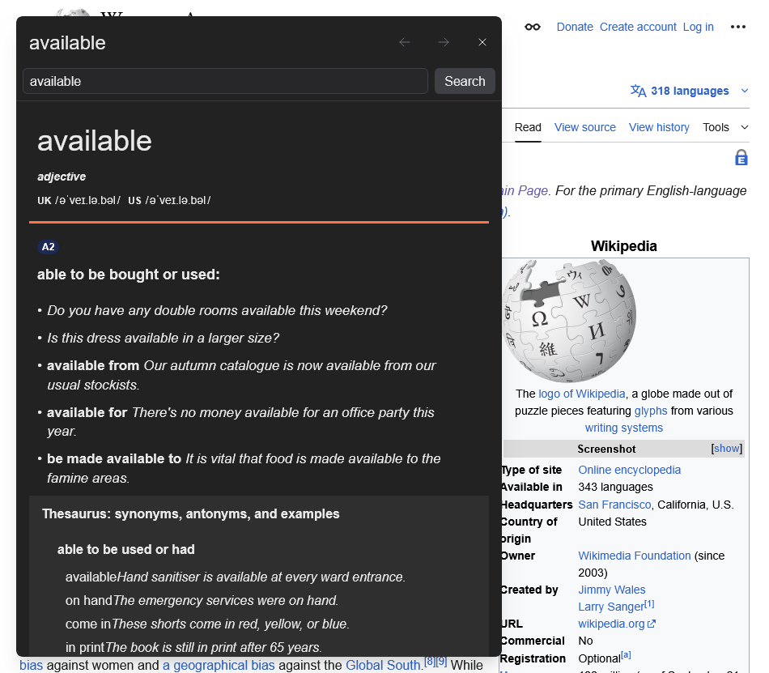

<h1> Cambridge Dictionary Pop</h1>

## Intro
Cambridge Dictionary Pop is a powerful browser extension designed to enhance your reading and learning experience. It allows you to quickly look up word definitions from Cambridge Dictionary directly on any webpage. Simply select a word, and a small icon will appear. Click or hover over this icon to instantly view the definition in a sleek, floating popup.

This extension goes beyond basic lookup, offering a rich set of features to make your vocabulary exploration seamless and efficient, all without navigating away from your current page.

## Features
*   **Instant Definition Lookup**: Select any word on a webpage to get its definition in a floating popup.
*   **In-Popup Search**: Search for new words directly within the popup without closing it.
*   **Definition History**: Navigate back and forward through your lookup history within the popup.
*   **Smart Caching**: Previously viewed definitions are cached for lightning-fast access.
*   **Internal Link Navigation**: Click on any word within a displayed definition to instantly look up its meaning in the same popup.
*   **Animated Popup**: Enjoy a smooth fade-in and slide-up animation when the popup appears.
*   **Intuitive Closure**: The popup automatically closes when you click anywhere outside of it.

## How to Use
1.  **Install the Extension**: Add Cambridge Dictionary Pop to your browser.
2.  **Select a Word**: On any webpage, select a word you want to look up.
3.  **Activate the Popup**:
    *   A small icon will appear near your selected text. Click this icon.
    *   Alternatively, hover over the icon for a brief moment to automatically open the popup.
4.  **Explore Definitions**:
    *   The definition will appear in a floating popup.
    *   **Search**: Use the search bar at the top of the popup to look up other words.
    *   **History**: Use the back and forward buttons to navigate through your recent lookups.
    *   **Internal Links**: Click on any word within the definition content to look up its meaning instantly.
5.  **Close the Popup**: Click anywhere outside the popup to close it.